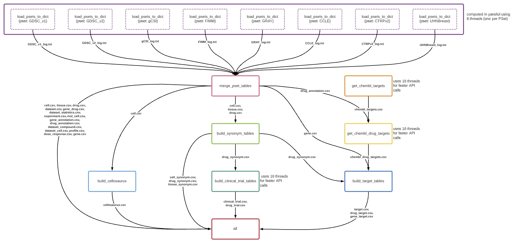

# PharmacoDI_snakemake_pipeline
A Snakemake pipeline to automate the scripts for creating all PharmacoDB database tables and allow easy deployment on a range of platforms.

The flow of the pipeline is as follows:
1. All PSets are processed individually and saved as .csv tables. A log file is generated for each PSet to note which tables were created.
2. The PSet tables are combined, and all primary key and foreign key columns are populated.
3. Hand-curated metadata files are used to build additional tables, such as `cell_synonym`.
4. Online pharmacogenomic resources, such as ChEMBL and UniProt, are queried to gather additional, up-to-date data on targets and clinical trials, which are saved to .csv tables with other metadata. 
5. The new metadata files are used to create the final PharmacoDB tables, such as `clinical_trial`.

This flow is illustrated in the DAG below. Nodes represent Snakemake rules, arrows show which rules generate output files that are then used as input files for other rules.
Arrows are annotated with file names to show inter-rule dependencies.

The pipeline is build to allow parallelization across PSets such that it can be deployed to a cluster.
